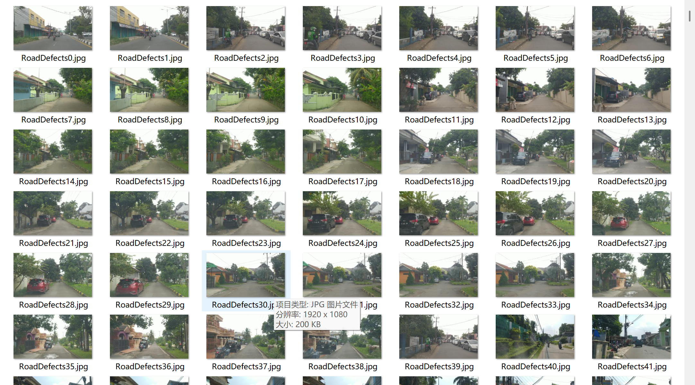
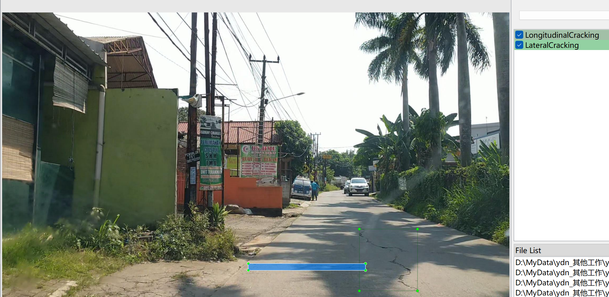

# Road Defect Detection - Target Detection Dataset

Dataset Information: The dataset consists of 5321 images and corresponding annotation files. The formats of the annotation files include two types: VOC-XML files in XML format and YOLO-formatted text files.

The targets to be detected are as follows:
- 'AlligatorCracking'
- 'LateralCracking'
- 'LongitudinalCracking'
- 'Pothole'

Each category has a list of images and the number of annotated bounding boxes. (Annotation is usually marked in English, and Chinese within brackets is provided for reference.)
Note: An image may contain multiple objects, so the total number of annotated bounding boxes might be greater than the total number of images.

The complete dataset includes three folders and one txt file:
Image size information:
- all_txt folder and classes.txt: Store the YOLO-formatted text annotations, which match the number of images. Each annotation file is one-to-one with an image.
- classes.txt: For a detailed understanding of the YOLO format, please refer to your own search results. In short, the number 0 represents the name at the position 0 in the array in classes.txt.
- all_xml file: VOC-formatted XML annotation files. They are also one-to-one with the number of images.
- For a detailed understanding of the VOC format, please refer to your own search results.
Both formats of annotations can be used, choose one according to your preference.
Annotation screenshots:

## Images

Here is a pay link on Stripe ( https://buy.stripe.com/3cs8yP7sY87d0vu9AB ). Please contact me lonlonago@foxmail.com after funding $89, and I will send you a complete data files , thank you!

